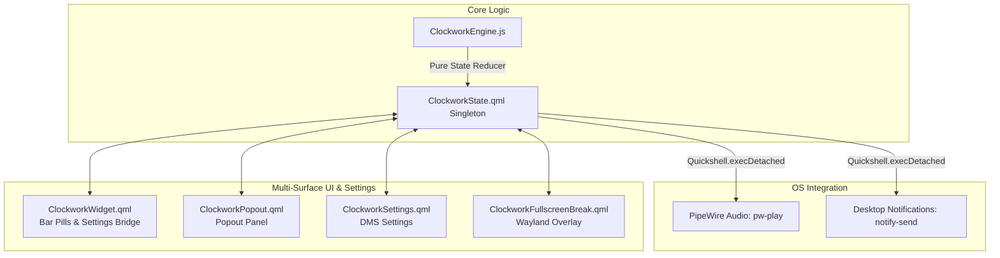

# AGENT.md - Clockwork for DankMaterialShell

This document serves as the primary architecture, design, and developer reference for contributors working on the **Clockwork** plugin for **DankMaterialShell** (DMS).

---

## 1. Project Mission & Identity

- **ID**: `clockwork`
- **Target Platform**: [DankMaterialShell](https://github.com/AvengeMedia/DankMaterialShell) (Quickshell, QtQuick 2, Material 3).
- **Core Purpose**: A native, lightweight, multi-mode productivity and time-tracking widget combining:
  1. **Stopwatch**: Precision count-up timer with centisecond accuracy.
  2. **Countdown**: Configurable timer with optional Wayland fullscreen break overlay and custom message.
  3. **Intervals**: High-intensity interval rounds with audible boundary pings.
  4. **Alarm**: One-shot alarm targeting next occurrence (12h/24h), audio ringtone, and urgent bar pulse.
  5. **Pomodoro**: Productivity cycle alternating focus work sessions with short and long breaks.
- **Strict Rule on Legacy Omarchy**: **ZERO backward compatibility with Omarchy**. Target DankMaterialShell natively without legacy aliases, deprecated wrappers, or compatibility shims.

---

## 2. Directory Structure & Key Files

```text
.
├── .gitignore                    # Git ignore rules (scratch, logs, cache, IDE)
├── AGENT.md                      # Developer reference & engineering guidelines
├── LICENSE                       # MIT License
├── README.md                     # User-facing manual, features & setup guide
├── plugin.json                   # DMS plugin manifest (validated against plugin-schema.json)
├── qmldir                        # QML module export declaration
├── ClockworkEngine.js            # Pure JavaScript state machine (.pragma library & CJS compatible)
├── ClockworkState.qml            # QML singleton bridging state, timers, audio, notifications & IPC
├── ClockworkWidget.qml           # PluginComponent: bar pills & settings bridge
├── ClockworkPopout.qml           # PopoutComponent: 5-mode tab UI, inputs & controls
├── ClockworkCompactField.qml     # Reusable M3 compact stepper component
├── ClockworkTimeField.qml        # Reusable M3 large editable time segment component
├── ClockworkSettings.qml         # PluginSettings: configuration page in DMS Settings
├── ClockworkFullscreenBreak.qml  # Wayland overlay break screen
└── tests/
    ├── plugin-schema.json        # DMS plugin schema definition (fallback)
    ├── test_engine.js            # Pure JS unit test suite (26/26 tests)
    ├── test_qml_syntax.sh        # qmllint syntax & import validator script
    └── validate_manifest.py      # jsonschema manifest validator
```

---

## 3. Architecture & Data Flow



1. **State Machine (`ClockworkEngine.js`)**:
   - Maintains pure functional state across all 5 modes.
   - Calculates target times, elapsed durations, progress ratios, and event boundaries.
   - Emits pure event descriptors (`sound`, `notify`).
   - Exports unified bounds via `LIMITS`.
   - Dual-compatible with both Node.js (`module.exports`) and QML (`.pragma library`).

2. **Reactive Singleton Bridge (`ClockworkState.qml`)**:
   - Declared as `pragma Singleton` with module alias `ClockworkCore`.
   - Owns the single `IpcHandler { target: "clockwork" }` across the entire shell session, eliminating IPC collisions in multi-monitor/multi-bar setups.
   - Dispatches audio effects (`pw-play`) and desktop notifications (`notify-send`) via non-blocking `Quickshell.execDetached()`.
   - **Adaptive Tick Rate**:
     - Runs at 20ms during stopwatch mode only when the popout is open (`popoutOpen`).
     - Throttles to 250ms otherwise (stopwatch background, countdown, intervals, pomodoro, alarm idle polling).
     - Repeats ring sound every 3000ms when ringing.
   - Guards all setters to prevent redundant recalculations or resets on active timers.

3. **Visual Widgets & Shell Integration**:
   - `ClockworkWidget.qml` implements `PluginComponent`, hosting `horizontalBarPill` and `verticalBarPill`.
   - Left-click toggles popout; middle-click starts/pauses; right-click pauses running timers, resets paused/completed timers, or silences ringing alarms.
   - Settings synchronization bridges edits from `ClockworkState` down to `PluginService.savePluginData()`.
   - `ClockworkFullscreenBreak.qml` activates as a high-contrast Wayland overlay (`WlrLayer.Overlay`) when countdown finishes with fullscreen breaks enabled. Uses `WlrLayershell.keyboardFocus: WlrKeyboardFocus.OnDemand` to avoid locking the compositor.

---

## 4. Critical UI & Theming Rules for DMS

### 4.1. Color Tokens & Theme Helpers
DMS uses dynamic Material 3 palettes generated via Matugen.
- **NEVER USE `Theme.onSurface` or `Theme.onPrimary`**:
  In DMS dynamic themes, `Theme.onSurface` and `Theme.onPrimary` evaluate to `#000000`. Using them causes text to render pitch-black on dark container surfaces.
- **Color Opacity / Alpha Helper**:
  Always use `Theme.withAlpha(color, alpha)`. **Never** access `.r`, `.g`, `.b` properties directly on color tokens (e.g., `Theme.outline.r`), as Matugen / QColor variant transitions can cause `.r` to be undefined or throw runtime evaluation errors.
- **Light/Dark Mode Contrast**:
  Never hardcode pastel hex colors (e.g. `#a6e3a1`). On light surface containers, `#a6e3a1` yields an unreadable ~1.8:1 contrast ratio. Always use dynamic Material 3 semantic tokens (`Theme.secondary`, `Theme.tertiary`, `Theme.surfaceVariantText`).
- **Always Use Verified DMS Tokens**:
  - Primary text on cards/surfaces: `Theme.surfaceText`
  - Secondary/muted text and subtitles: `Theme.surfaceVariantText`
  - Accent / Primary highlight: `Theme.primary`
  - Text on top of `Theme.primary`: `Theme.primaryText`
  - Container backgrounds: `Theme.surfaceContainerHigh`, `Theme.surfaceContainerHighest`
  - Alerts & Errors: `Theme.error`

### 4.2. Layout Positioners & Popout Sizing
- **Never place anchored items (`anchors.fill: parent`) directly inside a `Row` or `Column`**:
  In Qt Quick, positioners attempt to layout all children sequentially. Placing an anchored item inside a `Row` breaks layout geometry and corrupts `implicitWidth`.
- **Bar Pills**:
  Always wrap the `Row` inside an `Item` that explicitly specifies:
  ```qml
  implicitWidth: horizontalRow.implicitWidth
  implicitHeight: horizontalRow.implicitHeight
  ```
  This allows DMS's `BasePill` to size the pill container accurately so it never overlaps or clips adjacent widgets.
- **PopoutComponent `implicitHeight` Rule (Critical DMS Trap)**:
  `PopoutComponent` in DMS inherits from `Column`. In QtQuick, `Column`'s `implicitHeight` is a **read-only** property calculated automatically from child items. **Never** assign `implicitHeight: ...` on `PopoutComponent` root, or QML will fail at runtime with:
  `Invalid property assignment: "implicitHeight" is a read-only property`. Let `Column` compute height naturally from its inner child items.

### 4.3. Popout Keyboard Routing Architecture
- `PluginPopout.qml` wraps plugin popout content in a container that grabs active focus on visibility change.
- In DMS (`DankPopoutStandalone.qml`), an internal `focusHelper` consumes all key events unless `root.contentHandlesKeys` is set to `true`.
- **Implementation in `ClockworkPopout.qml`**:
  1. Sets `root.parentPopout.contentHandlesKeys = true;` when the parent popout is attached and on visibility change.
  2. Uses `Qt.callLater(() => root.forceActiveFocus())` to ensure the popout receives active keyboard focus.
  3. Provides fallback handling for both `event.key` and `event.text` so `1`–`5`, `Space`, `Enter`, `R`, `S`, and `Escape` function seamlessly across international keyboard layouts.
  4. Preserves typing focus whenever child `TextInput` editors are active.

### 4.4. Multi-Monitor Safety & Persistence
- DMS instantiates `ClockworkWidget.qml` once per connected monitor.
- Disk state persistence (`settingSaveRequested`), audio notifications, and Wayland fullscreen overlays must be gated to the primary instance using `(root.isFirst ?? true)` to prevent duplicate disk writes and competing overlay focus.

### 4.5. DMS Plugin Settings Components
Only the following components are available in `qs.Modules.Plugins`:
- `SliderSetting`, `StringSetting`, `ToggleSetting`, `SelectionSetting`, `ColorSetting`, and `ListSettingWithInput`.
- **Never** use fictitious components like `SpinBoxSetting` or `TextFieldSetting`.

### 4.6. Pure JS Engine Snapshots (DMS Rule 2)
Never pass raw `QQuickItem` instances into pure JS engine calculations. Always pass plain JavaScript snapshot objects (`root.getEngineSnapshot()`) to preserve pure separation of concerns and avoid memory leaks.

### 4.7. Internationalization (I18n)
All user-facing strings must use `I18n.trFor("clockwork", "...")` instead of generic `I18n.tr("...")` so DMS can extract translation catalogs specifically for this plugin.

### 4.8. Iconography
- **Material Symbols Font**: `DankIcon` uses the bundled `MaterialSymbolsRounded` font.
- **Pomodoro Icons**:
  - Focus session: `work` icon.
  - Break session: `emoji_food_beverage` (tea cup) icon.

---

## 5. IPC Interface Reference

All functions can be triggered via `dms ipc call clockwork <function> [args...]`:

| Function | Arguments | Return Token | Description |
| :--- | :--- | :--- | :--- |
| `status` | *(none)* | JSON string | Returns live JSON status of active mode, running state, and progress |
| `open` | *(none)* | `CLOCKWORK_POPOUT_OPENED` | Opens the Clockwork popout panel |
| `close` | *(none)* | `CLOCKWORK_POPOUT_CLOSED` | Closes the Clockwork popout panel |
| `togglePopout` | *(none)* | `CLOCKWORK_POPOUT_TOGGLED` | Toggles the Clockwork popout panel |
| `start` | *(none)* | `CLOCKWORK_STARTED` | Starts the active timer |
| `pause` | *(none)* | `CLOCKWORK_PAUSED` | Pauses the active timer |
| `toggle` | *(none)* | `CLOCKWORK_RUNNING` or `CLOCKWORK_PAUSED` | Toggles between start and pause |
| `reset` | *(none)* | `CLOCKWORK_RESET` | Resets active timer (or silences ringing alarm) |
| `skip` | *(none)* | `CLOCKWORK_POMODORO_SKIPPED` | Skips current Pomodoro phase (focus ↔ break) |
| `stopwatch` | *(none)* | `CLOCKWORK_STOPWATCH_STARTED` | Switches to Stopwatch and starts counting |
| `countdown` | `[min] [sec]` | `CLOCKWORK_COUNTDOWN_STARTED` | Sets countdown duration and starts |
| `intervals` | `[rounds] [min] [sec]` | `CLOCKWORK_INTERVALS_STARTED` | Configures interval rounds and starts |
| `alarm` | `[hour] [min] [msg]` | `CLOCKWORK_ALARM_ARMED` | Sets one-shot alarm target and arms it |
| `pomodoro` | `[work] [short] [cycles] [long]` | `CLOCKWORK_POMODORO_STARTED` | Configures Pomodoro parameters and starts |

Invalid arguments return `ERROR_INVALID_ARGUMENTS`, and unrecognized commands return `ERROR_UNKNOWN_COMMAND`.

---

## 6. Verification & Testing Workflow

Before committing any changes, always run the full verification test suite:

1. **Unit Tests (Core Engine)**:
   ```bash
   node tests/test_engine.js
   # Must return 26 passed, 0 failed
   ```

2. **QML Syntax & Module Validator**:
   ```bash
   bash tests/test_qml_syntax.sh
   # Must pass qmllint on all 7 components with 0 errors
   ```

3. **Plugin Manifest Schema Validation**:
   ```bash
   uv run --with jsonschema python3 tests/validate_manifest.py
   # Must pass strict JSON schema validation against plugin-schema.json
   ```

4. **Live Shell Reload & IPC Verification**:
   ```bash
   dms restart
   dms ipc call clockwork status
   dms ipc call clockwork open
   ```
