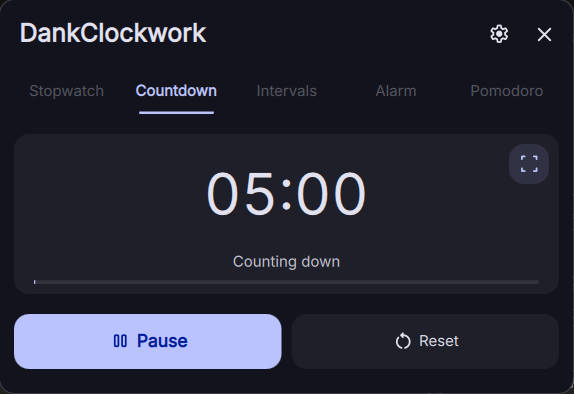

# DankClockwork

A DankMaterialShell bar plugin with Stopwatch, Countdown, Intervals, Alarm, and Pomodoro modes.



## Install

Requires DankMaterialShell 1.4 or newer, `pw-play`, `notify-send`, and the freedesktop sound theme in `/usr/share/sounds/freedesktop/stereo/`.

```bash
mkdir -p ~/.config/DankMaterialShell/plugins
ln -s /path/to/dankClockwork ~/.config/DankMaterialShell/plugins/dankClockwork
dms restart
```

Enable DankClockwork in DMS Settings → DankBar widgets.

The plugin ID and IPC target are `dankClockwork`. When updating an older install, rename its `clockwork` plugin directory, saved settings key, and bar widget ID to `dankClockwork`.

## Controls

Click the bar widget to open the popout; middle-click to start or pause. Right-click dismisses or cancels an alarm, pauses a running timer, or resets an idle timer.

Edit countdown duration, interval rounds, and Pomodoro durations directly in the popout. These edits save your preferences. The fullscreen icon at the top-right of the Countdown timer toggles the break overlay.

The controls follow DMS theme spacing, corner radius, and font scaling.

The gear button opens plugin settings, which contain only clock format, alarm sound, reminder text, and bar text visibility. Automatic timer completions chime; manually skipping a Pomodoro phase does not. Alarms ring until dismissed, for up to three minutes.

| Shortcut | Action |
| --- | --- |
| `1`–`5` | Select a mode |
| Space / Enter | Start, pause, or dismiss a ringing alarm |
| `R` | Reset |
| `S` | Skip a Pomodoro phase |
| Escape | Close the popout |

Shortcuts do not interfere with typing in numeric fields. Reset a session with progress before changing modes. The fullscreen reminder appears on each connected monitor; Escape dismisses it.

## IPC

```bash
dms ipc call dankClockwork stopwatch
dms ipc call dankClockwork countdown 5 0
dms ipc call dankClockwork intervals 8 0 30
dms ipc call dankClockwork alarm 7 30 "Wake up"
dms ipc call dankClockwork pomodoro 25 5 4 15
dms ipc call dankClockwork status
```

Supply all arguments shown, including the alarm message (use `""` for no custom message). Pomodoro arguments are focus minutes, short break minutes, cycles, and long break minutes. Countdown seconds carry into minutes: `countdown 0 90` starts 1:30.

Mode commands configure and restart the timer. IPC values are temporary; Reset restores saved preferences. Other commands: `start`, `pause`, `toggle`, `reset`, `skip`, `open`, `close`, and `togglePopout`.

## Tests

Requires Node.js 22+, Qt 6 QtTest and `qmltestrunner`, `qmllint`, and Python with `jsonschema`.

```bash
node tests/test_engine.js
node tests/test_engine_regressions.js
node --test --test-isolation=none tests/test_bridge.js
bash tests/test_qml_runtime.sh
bash tests/test_qml_syntax.sh
uv run --with jsonschema python3 tests/validate_manifest.py
```

The Qt suite runs production state and controls with stubbed DMS and native process/IPC boundaries. Verify compositor surfaces, desktop notifications, and audio in the live shell.
